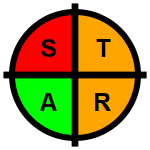

# STAR Data Quality Assurance Icons
Produce a full set of STAR data quality icons in .PNG format for use in performance reports.  The icons are drawn using the {grid} package.

---
## Project Description
This project produces a set of RAG quadrant icons needed for some performance reports.  The icon set can then be automatically rendered into reports (for example using RMarkdown).  
The project is not intended to present the STAR process itself, but in brief summary (to help understand the code):  
* S - Signoff & validation
* T - Timely & complete
* A - Audit & accuracy
* R - Robust systems & data capture

Rated on a RAG scale where:
* Green - Good assurance
* Amber - Acceptable assurance with action plan to move to green
* Red - Limited or no assurance

---
## How to use
Two options:
1. Take the complete icon set from the `output` folder.  The full icon set is 82 files (81 permutations of 3 colours applied to 4 quadrants, plus a single "white" icon).  
or
2. To start customising icons, run the R code, starting with `R/main.R`.  
This way you can customise sizes, colours, shapes, number of quadrants, etc to produce the icon set that you need.  

The function `make_icon_png()` will render a single icon to a png file.  You must pass a character string with 4 letters, representing the colour of each quadrant.  

For example `make_icon_png("RAGA")` will create the `star_RAGA.png` icon, and save it to the `output` folder:  

